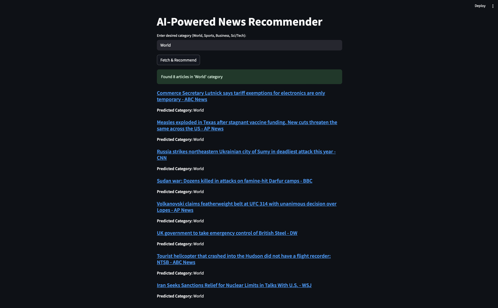

# AI-Powered News Recommender

This project is a news recommendation system built using a **BERT model trained from scratch**, pretrained on **WikiText-103**, and **fine-tuned on AG News** dataset. The app is powered by **Streamlit** and uses **NewsAPI** to fetch the latest headlines. Based on user input, it classifies the articles and recommends news items from the selected category.



---

## Features

- Custom BERT architecture implemented from scratch
- Pretrained on WikiText-103 for language modeling
- Fine-tuned on AG News for 4-class text classification:
  - World
  - Sports
  - Business
  - Sci/Tech
- Simple and interactive Streamlit UI
- Latest headline fetching using [NewsAPI](https://newsapi.org/)
- Intelligent category-based filtering and recommendation

---


## Model Pipeline

1. **Pretraining**: Masked Language Modeling and Next Sentence Prediction on [WikiText-103](https://blog.einstein.ai/the-wikitext-long-term-dependency-language-modeling-dataset/)
2. **Fine-tuning**: Classification on [AG News](https://www.di.unipi.it/~gulli/AG_corpus_of_news_articles.html)
3. **Prediction**: Top headlines fetched using NewsAPI are classified, and only those matching the user’s category input are displayed.

---

## Setup Instructions

### 1. Clone the Repository

```bash
git clone https://github.com/yourusername/bert-news-recommender.git
cd bert-news-recommender

